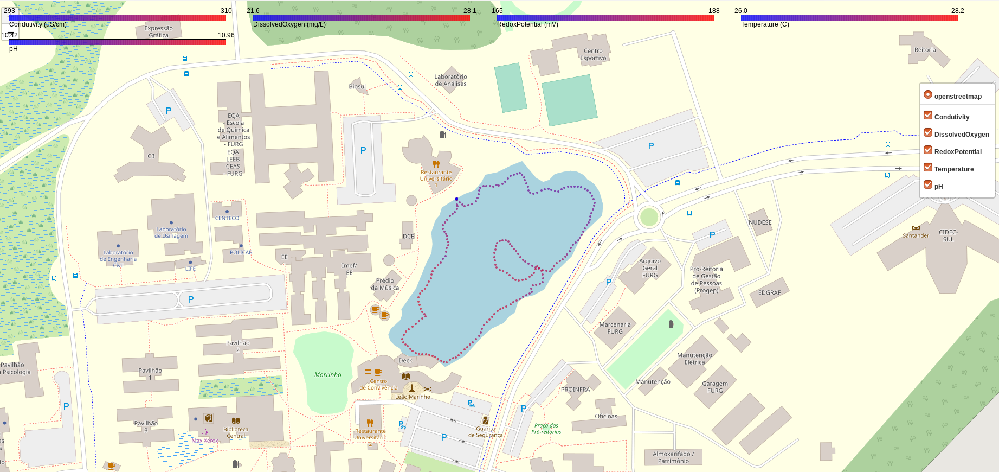

# usv-geo-data-analysis
geo analysis script for data collected by the USVs 

## Introduction

LSA's USVs use [Atlas Scientific's water quality sensor kit](https://www.atlas-scientific.com/product_pages/kits/env-sds-kit.html) and water depth obtained from a [Lowrance Elite 5-TI](https://www.lowrance.com/lowrance/type/fishfinders-chartplotters/elite-5-ti-no-xdcr) side-scanner. These data is typically saved in ROSbags and post-processed with the scripts presented in this repository.

This repository uses a three-step flow to analyse the collected data:
 * Step 1) extract the the original rosbag the important data using *filter_rosbag.sh* script;
 * Step 2) the resulting rosbag from Step 1 is executed with *rosbag2geopandas.py* to generate ROS-independent data files. This is step is required because ROS only supports Python 2.x, while most modern plotting tools are currently supporting only Python 3.x;
 * Step 3) the resulting Pandas file from the previous step is processed with *pandas2charts.py* to generate Folium-based maps with the data colleted by the USV

## How to Install

### Step 1

Requires ROS Kinetic and Ubuntu 16.04.

```
cd ~/ros_catkin_ws/src
git clone https://github.com/disaster-robotics-proalertas/atlas-ros.git
catkin_make -DCMAKE_BUILD_TYPE=Release
source ~/ros_catkin_ws/devel/setup.bash
```

### Step 2

Requires ROS Kinetic and Ubuntu 16.04.

```
sudo apt-get install python-pandas
sudo apt-get install python-geopandas
sudo apt-get install rospy_message_converter
cd ~/ros_catkin_ws/src
git clone https://github.com/disaster-robotics-proalertas/atlas-ros.git
git clone https://github.com/eurogroep/rosbag_pandas.git
catkin_make -DCMAKE_BUILD_TYPE=Release
source ~/ros_catkin_ws/devel/setup.bash
```
### Step 3

This step assumes Ubuntu 16.04 and [conda](https://docs.conda.io/projects/conda/en/latest/user-guide/install/linux.html).
This step is ROS-independent.

```
conda create -n geo_env
conda activate geo_env
conda install anaconda-clean
conda install -c conda-forge folium
conda install geopandas
conda install folium
conda install matplotlib
```

These packages are not required but recommended.

```
conda install flask
conda install jupyter
```


## How to Run

### Step 1
 
```
./filter_rosbag.sh <source.bag> <generated.bag>
```

### Step 2

We provide one example rosbag in './data/furg-lake.bag' generated by Step 1.  

```
python -V # must be 2.X to have ROS compatibility
python ./rosbag2geopandas.py ./data/furg-lake.bag
```

### Step 3
 
```
conda activate geo_env
python -V # must be 3.X to have plotting tools such as folium 
python ./pandas2charts.py ./data/furg-lake.bag-df.pkl
firefox ./data/furg-lake.bag-folium.html &   # to open the map with the USV data plotted by layers
```

On Firefox, you will see the following example. Select the Layers of data you want to see.



It also generates basic statistics about the data collected by the USVs

```
$ python pandas2charts.py ./data/furg-lake.bag-df.pkl
       Condutivity  DissolvedOxygen  RedoxPotential  Temperature          pH
count   239.000000       239.000000      239.000000   239.000000  239.000000
mean    302.131380        26.523891      172.234728    27.252251   10.847092
std       5.247477         1.709656        6.145211     0.715696    0.135265
min     290.700012        20.290001      162.600006    25.677999   10.379000
25%     297.949997        26.280001      167.800003    26.721001   10.841000
50%     302.000000        27.000000      171.899994    27.344000   10.886000
75%     306.449997        27.615001      174.500000    27.905500   10.919000
max     311.299988        28.580000      191.000000    28.268999   11.003000
```


## Future work

* Make this flow online, allowing to read the data in the map while the USV is navigating. Step 2 can generate data into a socket channel instead of a file.
* Make it read multiples bags at once and merge the Pandas files generated in Step 2 to plot data from all bags in the same chart
* Test the flow with depth data

Author: Alexandre Amory
